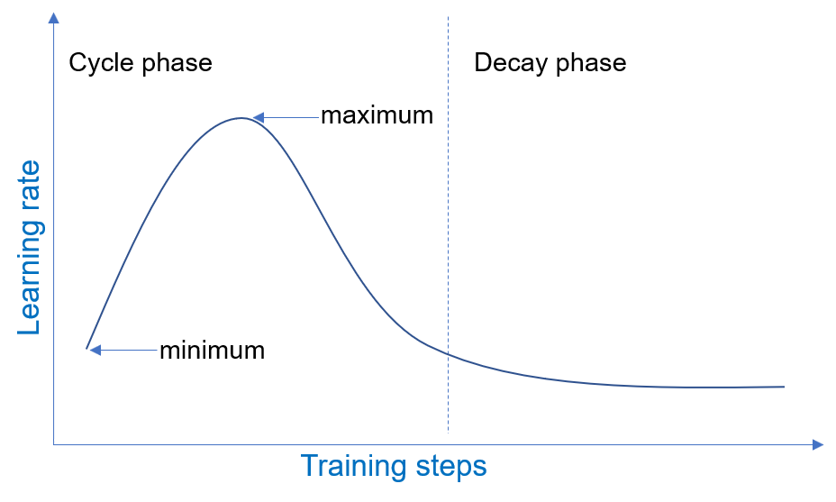
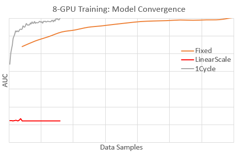
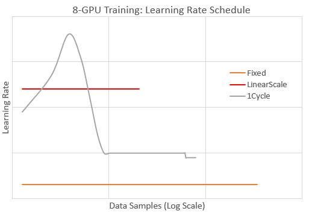

# Tutorial: 1-Cycle Schedule
This tutorial shows how to implement 1Cycle schedules for learning rate and
momentum in PyTorch.

## 1-Cycle Schedule
Recent research has demonstrated that the slow convergence problems of large
batch size training can be addressed by tuning critical hyperparameters such
as learning rate and momentum, during training using cyclic and decay
schedules. In DeepSpeed, we have implemented a state-of-the-art schedule called
[1-Cycle](https://arxiv.org/abs/1803.09820) to help data scientists
effectively use larger batch sizes to train their models in PyTorch.

## Prerequisites

To use 1-cycle schedule for model training, you should satisfy these two requirements:

1. Integrate DeepSpeed into your training script using this
[guide](../..//README.md#getting-started).
2. Add the parameters to configure a 1-Cycle schedule to the parameters of your
model. We will define the 1-Cycle parameters below.

## Overview
The 1-cycle schedule operates in two phases, a cycle phase and a decay phase,
which span one iteration over the training data. For concreteness, we will
review how 1-cycle schedule of learning rate works. In the cycle phase,
lonboardearning rate oscillates between a minimum value and a maximum value over a
number of training steps. In the decay phase, the learning rate decays starting
from the minimum value of the cycle phase. An example of 1-cycle learning rate
schedule during model training is illustrated below.



### 1-Cycle Parameters

The 1-Cycle schedule is defined by a number of parameters which allow users
explore different configurations. The literature recommends concurrent tuning
of learning rate and momentum because they are correlated hyperparameters. We
have leveraged this recommendation to reduce configuration burden by organizing
the 1-cycle parameters into two groups to:

1. Global parameters for configuring the cycle and decay phase
2. Local parameters for configuring learning rate and momentum

The global parameters for configuring the 1-cycle phases are:

1. `cycle_first_step_size`: The count of training steps to complete first step of cycle phase
2. `cycle_first_stair_count`: The count of updates (or stairs) in first step of cycle phase
3. `cycle_second_step_size`: The count of training steps to complete second step of cycle phase
4. `cycle_second_stair_count`: The count of updates (or stairs) in the second step of cycle phase
5. `post_cycle_decay_step_size`: The interval, in training steps, to decay hyperparameter in decay phase

The local parameters for the hyperparameters are:

**Learning rate**:

1. `cycle_min_lr`: minimum learning rate in cycle phase
2. `cycle_max_lr`: maximum learning rate in cycle phase
3. `decay_lr_rate`: decay rate for learning rate in decay phase

Although appropriate values `cycle_min_lr` and `cycle_max_lr` values can be
selected based on experience or expertise,  we recommend using [learning rate
range test](lrrt.md) feature of DeepSpeed to configure
them.

**Momentum**
1. `cycle_min_mom`: minimum momentum in cycle phase
2. `cycle_max_mom`: maximum momentum in cycle phase
3. `decay_mom_rate`: decay rate for momentum in decay phase

## Required Model Configuration Changes

To illustrate the required model configuration changes to use 1-Cycle schedule
in model training, we will use a schedule with the following properties:

1. A symmetric cycle phase, where each half of the cycle spans the same number
of training steps.  For this example, it will take 1000 training steps for the
learning rate to increase from 0.0001 to 0.0010 (10X scale), and then to
decrease back to 0.0001. The momentum will correspondingly cycle between 0.85
and 0.99 in similar number of steps.
2. A decay phase, where learning rate decays by 0.001 every 1000 steps, while
momentum is not decayed.

Note that these parameters are processed by DeepSpeed as session parameters,
and so should be added to the appropriate section of the model configuration.

### **PyTorch model**

PyTorch versions 1.0.1 and newer provide a feature for implementing schedulers
for hyper-parameters, called  [learning rate
  schedulers](https://pytorch.org/docs/stable/_modules/torch/optim/lr_scheduler.html).
  We have implemented 1-Cycle schedule using this feature.  You will add a
  scheduler entry of type **"OneCycle"** as illustrated below.

```json
"scheduler": {
    "type": "OneCycle",
    "params": {
        "cycle_first_step_size": 1000,
        "cycle_first_stair_count": 500,
        "cycle_second_step_size": 1000,
        "cycle_second_stair_count": 500,
        "decay_step_size": 1000,
        "cycle_min_lr": 0.0001,
        "cycle_max_lr": 0.0010,
        "decay_lr_rate": 0.001,
        "cycle_min_mom": 0.85,
        "cycle_max_mom": 0.99,
        "decay_mom_rate": 0.0
    }
},
```

## Batch Scaling Example

As example of how 1-Cycle schedule can enable effective batch scaling, we
briefly share our experience with an internal model in Microsoft. In this case,
the model was well-tuned for fast convergence (in data samples) on a single
GPU, but was converging slowly to target performance (AUC) when training on 8
GPUs (8X batch size). The plot below shows model convergence with 8 GPUs for
these learning rate schedules:

1. **Fixed**: using an optimal fixed learning rate for 1-GPU training.
2. **LinearScale**: using a fixed learning rate that is 8X of **Fixed**.
3. **1Cycle**: using 1-Cycle schedule.



With **1Cycle**, the model converges faster than the other schedules to the
target AUC . In fact, **1Cycle** converges as fast as the optimal 1-GPU
training (not shown). For **Fixed**,  convergence is about 5X slower (needs 5X
more data samples). With **LinearScale**, the model diverges because the
learning rate is too high. The plot below illustrates the schedules by
reporting the learning rate values during 8-GPU training.



We see that the learning rate for **1Cycle** is always larger than **Fixed**
and is briefly larger than **LinearScale** to achieve faster convergence. Also
**1Cycle** lowers the learning rate later during training to avoid model
divergence, in contrast to **LinearScale**. In summary, by configuring an
appropriate 1-Cycle schedule we were able to effective scale the training batch
size for this model by 8X without loss of convergence speed.
